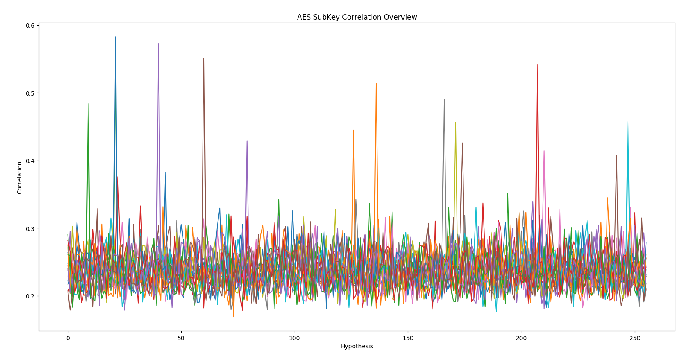

# Side Channels 'n' Stuff

The fuckshitfuck toolkit is a repository of code used for side channel acquisition, preprocessing and analysis, similar to the ChipWhisperer, but written ground-up as an (extremely successful) learning exercise.

This toolkit comprises:

- Acquisition:
  - ./grab3.py, for acquisition from picoscope scopes
  - ./rigol-new.py, for acquisition from rigol scopes
  - ./x/fuck.py, for pcsc+picoscope acquisition from smartcards
- Preprocessing:
  - ./preprocessor.py, for temporal alignment and of traces
- Analysis:
  - ./dpa-finder.py, for finding where maximum leakages are in a signal
  - ./cpa.py, for sbox-output correlation against AES
  - ./cpa-des.py, for correlation attacks against DES
  - ./dpa.py, for sbox-output last-bit differential analysis against AES

Some test targets are provided in target/ and pictarget-3.X/

The code is provided as-is, pull requests and feature requests are welcome.
