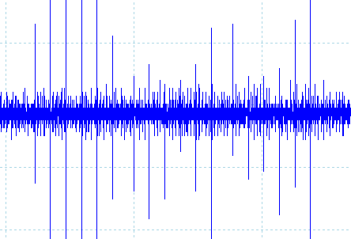

# Keyboard Tools

This sub-toolkit is for capturing the EM emissions from a keyboard, similar to the work of Martin Vuagnoux and Sylvaini Pasini (see: lasecwww.epfl.ch/keyboard), and further expanded on in "SoK: Keylogging Side Channels" (see: ieeexplore.ieee.org/document/8418605).

Note that we do not rely on delay - instead, we rely on the shape and duration of electromagnetic emissions.

This directory uses dual channel measurement by default, to improve the accuracy of any correlation attacks.
